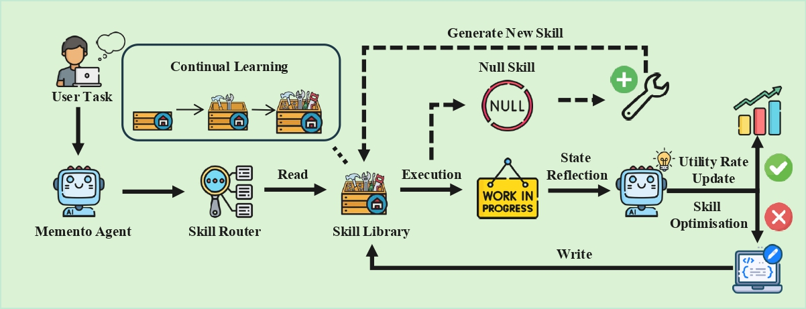
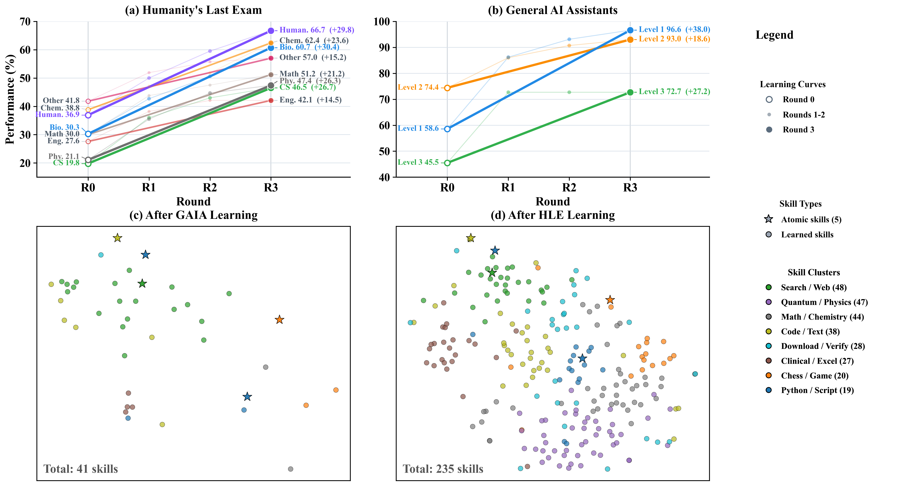
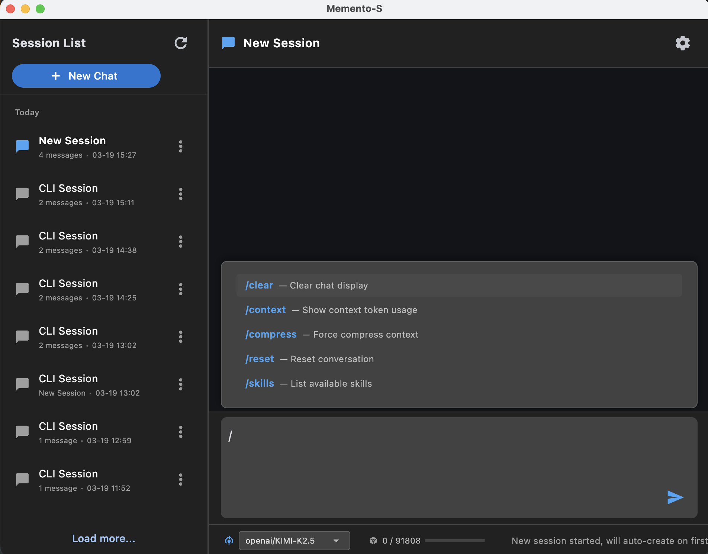

<h1 align="center">Memento-Skills: Let Agents Design Agents</h1>

<h3 align="center"><b>Deploy an agent. Let it learn, rewrite, and evolve its own skills.</b></h3>

<p align="center">
  
</p>

<p align="center">
  
  
  
  
  
  
  
  
</p>

<p align="center">
  <a href="#what-is-memento-skills">What Is This</a> ·
  <a href="#what-makes-it-different">Why It Matters</a> ·
  <a href="#memento-skills-vs-openclaw">Memento-Skills vs OpenClaw</a> ·
  <a href="#learning-results">Learning Results</a> ·
  <a href="#deployment-surfaces">Deployment</a> ·
  <a href="#quick-start">Quick Start</a> ·
  <a href="#citation">Citation</a>
</p>

<p align="center">
  <a href="#what-is-memento-skills"><b>English</b></a> ·
  <a href="#chinese-summary"><b>中文摘要</b></a>
</p>

---

> **Core question.** Memento-Skills is not centered on "how to make an assistant run."  
> It is centered on **how to make an agent learn** from deployment experience, reflect on failure, and rewrite its own skill code and prompts.

<table>
<tr>
<td width="33%" valign="top">
<b>Learn from failure</b><br>
Failures are treated as training signals, not just reasons to retry.
</td>
<td width="33%" valign="top">
<b>Rewrite its own skills</b><br>
The system can optimize prompts, modify skill code, and create new skills when needed.
</td>
<td width="33%" valign="top">
<b>Run in the real world</b><br>
Local execution, persistent state, CLI, GUI, and IM integration make it deployable beyond a paper demo.
</td>
</tr>
</table>

## ✨ Key Features

| Feature | Why it matters |
| --- | --- |
| **Fully self-developed agent framework** | Memento-Skills is not a thin wrapper over someone else's assistant runtime. It ships its own orchestration, skill routing, execution, reflection, storage, CLI, and GUI stack. |
| **Designed for Chinese LLM ecosystems** | The profile-based LLM layer is especially friendly to mainstream Chinese model platforms such as **Kimi / Moonshot**, **MiniMax**, **GLM / Zhipu**, as well as other domestic OpenAI-compatible endpoints. |
| **Skill self-evolution loop** | The system is designed to learn from failure, revise weak skills, and grow a skill library that improves over time instead of staying static. |
| **Local-first deployment surfaces** | CLI, desktop GUI, Feishu bridge, local sandbox execution, and persistent state make it practical for real-world deployment rather than one-off demos. |

## 🧠 What Is Memento-Skills?

Memento-Skills is a **fully self-developed agent framework** organized around `skills` as first-class units of capability. Skills are retrievable, executable, persistent, and evolvable. Instead of treating tools as a flat pile of functions, Memento-Skills treats them as a growing library that can be routed, evaluated, repaired, and rewritten over time.

What makes it interesting is not just whether the agent can call tools. It is what happens **after failure**. Memento-Skills tries to identify which skill failed, reflect on why it failed, improve or regenerate that skill, and write the improved capability back into the skill library.

## 🔄 What Makes It Different?

Memento-Skills is built around a continual `Read -> Execute -> Reflect -> Write` loop.

| Loop | What it means |
| --- | --- |
| **Read** | Retrieve candidate skills from the local library and remote catalog instead of stuffing every skill into context. |
| **Execute** | Run skills through tool calling and a local sandbox so the agent can act on files, scripts, webpages, and external systems. |
| **Reflect** | When execution fails or quality drops, record state, update utility, and attribute the issue to concrete skills whenever possible. |
| **Write** | Optimize weak skills, rewrite broken ones, and create new skills when no existing capability is good enough. |

This is the key difference from systems that simply keep accumulating more skills in the workspace. Memento-Skills cares about whether a large skill library can still be **retrieved correctly, repaired correctly, and improved continuously**.

## ⚖️ Memento-Skills vs OpenClaw

The two systems share a lot of DNA, but they are not centered on the same question.

- OpenClaw is more about getting an assistant to run in the real world.
- Memento-Skills is more about getting an agent to learn from the real world.

### Shared Foundation

| Common Ground | Memento-Skills | OpenClaw |
| --- | --- | --- |
| Skills as capability units | Yes | Yes |
| Deployable, engineerable system | Yes | Yes |
| Tool use and local execution | Yes | Yes |
| Persistent or stateful memory | Yes | Yes |

### Key Differences

| Dimension | Memento-Skills | OpenClaw |
| --- | --- | --- |
| **Product focus** | Focused on how an agent learns. It emphasizes learning from deployment experience, reflecting on mistakes, and rewriting its own skill code and prompts. | Focused on how an assistant gets deployed and connected to the real world. |
| **Learning and evolution** | Failure triggers a read-write reflection loop: locate the failing skill, revise it, and create a new skill when needed. | Capability growth is more commonly driven by external plugins, tools, and human-provided integrations. |
| **Skill routing** | Treats retrieval and routing as core problems, especially when the skill library becomes large. | Better optimized for broad real-world integrations; context and hit-rate management depend more on the surrounding engineering setup. |
| **Skill download** | Includes a cloud catalog plus download flow, moving toward deduped and validated reusable skills. | More open-ended ecosystem growth, with quality and duplication control relying more on platform or community processes. |
| **Skill creation** | Can create a new skill when nothing suitable exists locally or remotely, and can recreate low-utility skills instead of repeatedly using bad ones. | Missing skills are more often supplied by humans or installed explicitly. |
| **Evaluation** | Emphasizes measured learning behavior on benchmarks such as GAIA and HLE. | Emphasizes assistant usability and real-world system integration. |
| **Use cases** | Hard multi-step reasoning plus daily productivity and personal life management. | Daily productivity, messaging, web tasks, devices, and real-world assistant workflows. |

In one sentence: **OpenClaw is about getting the assistant running; Memento-Skills is about getting the agent learning.**

## 📈 Learning Results

<p align="center">
  
</p>

This figure highlights two signals. First, performance improves over multiple learning rounds on HLE and related assistant settings. Second, the skill library grows from a small set of atomic skills into a richer set of learned skills. The point is not merely to add more tools. The point is to **learn better skills through task experience**.

## 🛠️ Deployment Surfaces

<p align="center">
  
</p>

The current repository already exposes multiple practical deployment surfaces, which makes Memento-Skills more than a paper concept.

| Surface | Current support | Notes |
| --- | --- | --- |
| **CLI** | `memento agent` | Interactive mode or single-message mode |
| **Desktop GUI** | `memento-gui` | Session list, chat UI, slash commands |
| **Feishu bridge** | `memento feishu` | WebSocket-based IM bridge with per-user persistent sessions |
| **Skill verification** | `memento verify` | Download, static review, and execution validation |
| **Local sandbox** | `uv` | Isolated skill execution, dependency install, and local tool invocation |

This makes the project suitable not only for benchmark-style agents, but also for personal productivity, long-running local assistants, and real deployment experiments.

## ⚡ One Repo. One Learning Agent.

```bash
python -m venv .venv && source .venv/bin/activate && pip install -e . && memento doctor && memento agent
```

## 🚀 Quick Start

```bash
git clone https://github.com/Memento-Teams/Memento-Skills.git
cd Memento-Skills
python -m venv .venv
source .venv/bin/activate
pip install -e .
```

On first launch, `~/memento_s/config.json` is created automatically. Fill in your model profile, then start the app:

```bash
memento doctor
memento agent
memento-gui
```

<details>
<summary><b>Example config.json</b></summary>

```jsonc
{
  "llm": {
    "active_profile": "default",
    "profiles": {
      "default": {
        "model": "openai/gpt-4o",
        "api_key": "your-api-key",
        "base_url": "https://api.openai.com/v1",
        "max_tokens": 8192,
        "temperature": 0.7,
        "timeout": 120
      }
    }
  },
  "env": {
    "TAVILY_API_KEY": "your-search-api-key"
  }
}
```

The `model` field uses the `provider/model` format, for example `anthropic/claude-3.5-sonnet`, `openai/gpt-4o`, or `ollama/llama3`.  
`TAVILY_API_KEY` is only required for web search.

The same profile system is also convenient for mainstream Chinese model ecosystems, including **Kimi / Moonshot**, **MiniMax**, **GLM / Zhipu**, and other OpenAI-compatible domestic endpoints.

</details>

<details>
<summary><b>Common commands</b></summary>

```bash
memento agent             # Interactive agent session
memento agent -m "..."    # Single-message mode
memento doctor            # Environment and config checks
memento verify            # Skill download / audit / execution validation
memento feishu            # Feishu IM bridge
memento-gui               # Desktop GUI
```

</details>

<details>
<summary><b>Supported LLM providers</b></summary>

| Provider | Model example | base_url |
| --- | --- | --- |
| Anthropic Claude | `anthropic/claude-3.5-sonnet` | default |
| OpenAI | `openai/gpt-4o` | default |
| OpenRouter | `anthropic/claude-3.5-sonnet` | `https://openrouter.ai/api/v1` |
| Ollama | `ollama/llama3` | `http://localhost:11434` |
| Chinese LLM ecosystems | Kimi, MiniMax, GLM, and similar endpoints | configurable via profile + `base_url` |
| Self-hosted | `openai/your-model` | custom endpoint |

</details>

## 🧩 Built-in Skills

The built-in skills are the starting point, not the end state. The goal is not to freeze the system at nine hand-written skills, but to maintain a skill library that can keep growing, keep being retrieved, and keep being repaired.

| Skill | Description |
| --- | --- |
| `filesystem` | File read, write, search, and directory operations |
| `web-search` | Tavily-based web search and page fetching |
| `image-analysis` | Image understanding, OCR, and caption-like tasks |
| `pdf` | PDF reading, form filling, merging, splitting, and OCR |
| `docx` | Word document creation and editing |
| `xlsx` | Spreadsheet processing |
| `pptx` | PowerPoint creation and editing |
| `skill-creator` | New skill creation, optimization, and evaluation |
| `uv-pip-install` | Python dependency installation via `uv` |

## 🧱 Developer Notes

<details>
<summary><b>Project structure</b></summary>

```text
Memento-Skills/
├── builtin/skills/        # Built-in skills
├── cli/                   # Typer CLI
├── core/                  # Agent orchestration, skill routing, execution
├── gui/                   # Flet desktop GUI
├── middleware/            # Config, storage, LLM clients
├── utils/                 # Shared helpers
├── daemon/                # Runtime packaging scaffolding
└── Figures/               # README figures
```

</details>

<details>
<summary><b>Tech stack</b></summary>

| Layer | Technology |
| --- | --- |
| Interface | Flet, Typer, Rich |
| LLM access | litellm |
| Retrieval | BM25, embeddings, sqlite-vec, cloud catalog |
| Execution | local subprocess plus `uv` sandbox |
| Storage | SQLite, SQLAlchemy, aiosqlite |
| Config | JSON plus Pydantic |
| Testing and verification | pytest, async validation flow, `memento verify` |

</details>

## ❓ FAQ

| Problem | Solution |
| --- | --- |
| Skills not found | Check the skill and workspace configuration in `~/memento_s/config.json`. |
| API timeout | Increase the active profile `timeout`. |
| Import errors | Make sure the virtual environment is active and rerun `pip install -e .`. |
| Web skill fails | Check whether `TAVILY_API_KEY` is configured and whether network access is available. |

## 📌 Citation

If you find Memento-Skills useful in your research, please cite:

- **Title:** Memento-Skills: Let Agents Design Agents
- **Authors:** Huichi Zhou, Siyuan Guo, Anjie Liu, Zhongwei Yu, Ziqin Gong, Bowen Zhao, Zhixun Chen, Menglong Zhang, Yihang Chen, Jinsong Li, Runyu Yang, Qiangbin Liu, Xinlei Yu, Jianmin Zhou, Na Wang, Chunyang Sun, Jun Wang
- **Paper:** https://arxiv.org/abs/2603.18743

```bibtex
@article{zhou2026mementoskills,
  title={Memento-Skills: Let Agents Design Agents},
  author={Zhou, Huichi and Guo, Siyuan and Liu, Anjie and Yu, Zhongwei and Gong, Ziqin and Zhao, Bowen and Chen, Zhixun and Zhang, Menglong and Chen, Yihang and Li, Jinsong and Yang, Runyu and Liu, Qiangbin and Yu, Xinlei and Zhou, Jianmin and Wang, Na and Sun, Chunyang and Wang, Jun},
  journal={arXiv preprint arXiv:2603.18743},
  year={2026},
  url={https://arxiv.org/abs/2603.18743}
}
```

## 🌏 Chinese Summary

<details>
<summary><b>点击展开中文摘要</b></summary>

Memento-Skills 的核心不是“怎么让 assistant 跑起来”，而是“怎么让 agent 学会”。它把能力组织成 `skills`，并围绕 `Read -> Execute -> Reflect -> Write` 的闭环，让 agent 在真实任务中发现失败、定位问题 skill、修改或重建 skill，再把结果写回 skill library。

和 OpenClaw 相比，两者都具备 skills、工具调用、本地执行、持久化记忆和系统化部署能力，但关注点不同。OpenClaw 更偏向让 assistant 稳定接入真实世界；Memento-Skills 更偏向让 agent 从真实部署经验中持续学习和自我演化。

当前仓库已经具备比较完整的本地落地能力，包括 CLI、桌面 GUI、飞书桥接、本地 sandbox 和 skill 验证流程，因此它不仅适合 benchmark 式 agent，也适合继续往个人助理、长期运行和真实世界任务代理方向推进。

</details>

## 📄 License

MIT
